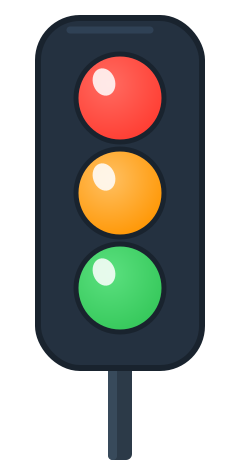
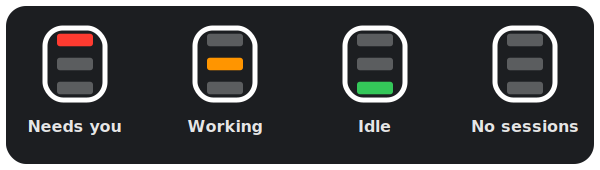

<p align="center">
  
</p>

<h1 align="center">Claude Light</h1>

<p align="center">A native macOS menu-bar traffic light for your Claude Code sessions — see what needs you, at a glance.</p>

<p align="center">
  <a href="LICENSE"></a>
  
  
  <a href="https://github.com/fr1j0/claude-light/releases"></a>
  
</p>

## Overview

Claude Light watches every Claude Code session on your Mac and distills them into a single traffic light in the menu bar. One glance tells you whether an agent is waiting on you, still working, or done — no alt-tabbing through terminals to find out.

## At a Glance

<p align="center">
  
</p>

The menu-bar icon reflects the most urgent state across all your sessions:

| Lamp | Meaning | Motion |
|------|---------|--------|
|  Top — red | A session needs you: a question, permission prompt, or review request is waiting | Blinks (question) · steady (permission, review) |
|  Middle — orange | At least one session is actively working | Gentle pulse |
|  Bottom — green | Sessions are idle; nothing needs you | Steady |
|  All dim | No live sessions | Steady |

Red always wins the aggregate, so a single waiting session is never buried behind busy ones. Motion is reserved for the menu bar — a blink to pull your eye when a session needs a reply, a soft pulse while work is underway — and state is conveyed by lamp position as well as color.

## The Dropdown

Click the icon for the full picture:

- A one-line summary header, such as `1 needs you · 2 working`.
- Every live session, sorted by urgency (needs-you first), each with a colored status dot, its project name, what it's doing, and how long ago it last changed.
- One-click install or removal of the Claude Code hooks, and quit.

## Features

- Native menu-bar app — lightweight, no dock icon, no window.
- Aggregate traffic light across any number of concurrent sessions.
- A distinct, chunky traffic-light icon that adapts to light and dark menu bars.
- Live updates via filesystem events — the display reacts within a fraction of a second.
- No polling, no network, no telemetry.
- Zero configuration beyond a one-click hook install.

## How It Works

Claude Light integrates with Claude Code through a small hook shim. On each Claude Code hook event, the shim writes that session's state to `~/.claude-light/sessions/`. The app watches that folder and updates its display the moment anything changes.

For the full technical design, see the specs under [`docs/superpowers/specs/`](docs/superpowers/specs/).

## Installation

### Homebrew (recommended)

```bash
brew tap fr1j0/claude-light
brew install --cask claude-light
```

### From GitHub Releases

Download the latest notarized `.app` from [GitHub Releases](https://github.com/fr1j0/claude-light/releases) and verify the published SHA-256 checksum to confirm authenticity.

## First Run

1. Launch Claude Light — a traffic-light icon appears in the menu bar.
2. Click the icon and choose **Install Claude Code hooks**. This safely merges the hook entries into `~/.claude/settings.json`.
3. Your next Claude Code prompt lights up the menu.
4. **Remove Claude Code hooks** cleanly undoes the change at any time.

## Build from Source

Requires Swift 5.9+ and macOS 13+.

```bash
swift build -c release          # build the app and hook binaries
swift test                      # run the test suite
bash scripts/package-app.sh     # produce dist/Claude Light.app
```

## Security & Trust

Claude Light edits your settings and runs on every Claude Code hook, so it is fully open source and auditable — read the source and verify it for yourself. Official builds are signed and notarized with the maintainer's Apple Developer ID, which removes the "unidentified developer" warning and guarantees the binary has not been tampered with.

Install only from the official [Releases](https://github.com/fr1j0/claude-light/releases), and verify the published SHA-256 checksum before running.

## License & Trademark

Licensed under [Apache-2.0](LICENSE). The name "Claude Light", logo, and icon are **not** licensed under Apache-2.0 — see [TRADEMARK.md](TRADEMARK.md) for details.

"Claude" is a trademark of Anthropic. This is an independent community project, not affiliated with or endorsed by Anthropic.
